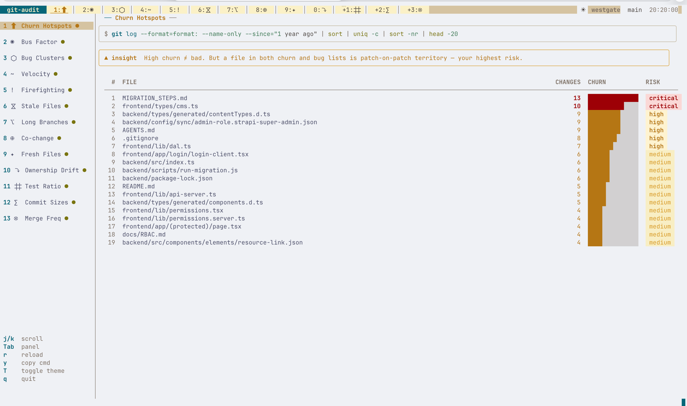

# git-audit

A lazygit-style terminal dashboard for codebase intelligence.
Runs the 5 git commands from [piechowski.io/post/git-commands-before-reading-code](https://piechowski.io/post/git-commands-before-reading-code/) and presents them as an interactive TUI.

Built with [Bubble Tea](https://github.com/charmbracelet/bubbletea) + [Lip Gloss](https://github.com/charmbracelet/lipgloss).



## Development

To run locally without building a binary:

```bash
# Run against the current directory
make run

# Or directly with go run, pointing at any repo
go run ./cmd/git-audit ~/projects/my-app
```

Use `make tidy` to sync dependencies after pulling changes:

```bash
make tidy
```

## Install

**Requirements:** Go 1.22+, git

```bash
# Clone
git clone https://github.com/you/git-audit
cd git-audit

# Fetch dependencies
go mod tidy

# Build
make build

# Or install to $GOPATH/bin
make install
```

## Usage

```bash
# Audit current directory
./git-audit

# Audit a specific repo
./git-audit ~/projects/my-app

# Or if installed
git-audit ~/projects/my-app
```

## Keybindings

| Key | Action |
|-----|--------|
| `1`–`5` | Jump to panel |
| `Tab` / `Shift+Tab` | Next / prev panel |
| `h` / `l` or `←` / `→` | Next / prev panel |
| `j` / `k` or `↓` / `↑` | Scroll list |
| `g` | Scroll to top |
| `G` | Scroll to bottom |
| `r` | Re-run current command |
| `y` | Copy raw git command to clipboard |
| `q` / `Ctrl+C` | Quit |

## Panels

| # | Panel | Git Command |
|---|-------|-------------|
| 1 | **Churn Hotspots** | Most-changed files in the last year |
| 2 | **Bus Factor** | Contributor commit distribution |
| 3 | **Bug Clusters** | Files most referenced in fix/bug commits |
| 4 | **Velocity** | Monthly commit count over full history |
| 5 | **Firefighting** | Revert/hotfix/rollback frequency |
| 6 | **Stale Files** | Files untouched for 1+ year |
| 7 | **Long-lived Branches** | Branches older than 90 days |
| 8 | **Co-change Coupling** | File pairs always committed together |
| 9 | **Fresh Files** | New files added in the last 90 days |
| 10 | **Ownership Drift** | Files that changed primary owner |
| 11 | **Test Ratio** | Ratio of test changes to source changes |
| 12 | **Commit Sizes** | Distribution of commit sizes |
| 13 | **Merge Frequency** | Monthly merge commit count |

## Stack

- [Bubble Tea](https://github.com/charmbracelet/bubbletea) — Elm-architecture TUI framework
- [Lip Gloss](https://github.com/charmbracelet/lipgloss) — layout and style
- [Bubbles](https://github.com/charmbracelet/bubbles) — spinner component
